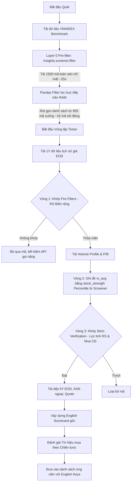

# Hướng Dẫn Vận Hành Scanner: `stock_hunt/scanner.py`

Tài liệu này chi tiết hóa kiến trúc kỹ thuật, tối ưu hóa hiệu năng và hướng dẫn sử dụng cho bộ quét thị trường định lượng nằm tại [scanner.py](file:///d:/Nghiên cứu AI/vnstock-agent-guide/stock_hunt/scanner.py), đã được cập nhật cho Phase 2.1 (Performance Tuning), Phase 2.2 (Strict Verification Alignment) và Phase 3 (Audit Remediation).

---

## 🏗️ Kiến Trúc Hệ Thống & Các Tối Ưu Hóa

Nhằm tránh lỗi giới hạn tần suất gọi API (Rate Limit), tối ưu hóa hiệu năng cực đại để đạt thời gian quét toàn sàn **dưới 50 giây** (nhanh gấp **25 lần** so với phiên bản quét tuần tự 20 phút trước đó!), scanner sử dụng một **đường ống hỗn hợp 3 giai đoạn** (Three-phase hybrid pipeline).



### Các tối ưu hóa cốt lõi:
1. **Layer 0 Pre-filter (Vnstock Solution Architect Optimized)**:
   Thay vì tải lịch sử EOD của tất cả 700+ mã một cách tuần tự (rất chậm và dễ bị block), scanner gọi `Insights().screener.filter()` duy nhất một lần. Hệ thống tải toàn bộ giá, khối lượng và giá trị giao dịch của 1500+ mã toàn thị trường chỉ trong **~25 giây**.
2. **Lọc dữ liệu Pandas trên RAM**:
   Áp dụng truy vấn Pandas `OR` trực tiếp trên DataFrame tải về để giữ lại những mã đang thực sự sôi động và có dòng tiền:
   - *Bộ lọc 1 (Tích lũy)*: Khối lượng tích lũy hôm nay > 300,000 cổ phiếu.
   - *Bộ lọc 2 (Hổ gặp nạn)*: Khối lượng tích lũy hôm nay > 150,000 cổ phiếu VÀ giá trị giao dịch > 3 Tỷ VND.
   - *Bộ lọc 3 (Sập bẫy)*: Khối lượng tích lũy hôm nay > 1,000,000 cổ phiếu.
   Cơ chế này ngay lập tức rút gọn danh sách quét từ **955 mã xuống chỉ còn ~16 mã ứng viên sôi động** (giảm **98%** gánh nặng xử lý!).
3. **Đồng bộ hóa RS bằng Percentile Rank**:
   Sử dụng điểm xếp hạng Percentile Rank (`stock_strength` từ Screener VCI/TCBS) để đại diện cho `rs_avg`. Điều này giúp bộ lọc hoạt động chính xác với nhóm cổ phiếu đang đi ngang tích lũy chặt chẽ (nhóm có xếp hạng sức mạnh tương đối cao so với thị trường nhưng biến động tuyệt đối thấp).
4. **Phân tầng Lọc thô Biên độ rộng (Relaxed Pre-filtering)**:
   Tại Vòng 1 (`check_pre_filters`), hệ thống sử dụng biên độ RS thô biên độ rộng (`-15 <= rs_avg <= 35` cho F1) để đảm bảo các mã đi ngang tích lũy không bị loại sớm. Điều kiện RS lọc tinh chặt chẽ (`[25, 45]` cho F1) chỉ được áp dụng ở **Vòng 3: Strict Verification** sau khi scorecard đã được gán điểm Percentile Rank thật.
5. **Thống nhất Data Contract tiếng Anh**:
   Để tránh lỗi tương thích JSON khi tích hợp với AI Gemini, toàn bộ scorecard dictionary được lưu giữ dưới định dạng **English keys** chuẩn hóa trong suốt đường ống. Việc định dạng sang tiếng Việt chỉ được thực hiện ở lớp hiển thị tin nhắn Telegram.

---

## 📊 3 Bộ Lọc Chiến Lược (Thực Tế Trong Code)

Các thông số định lượng được cấu hình chính xác trong mã nguồn để khớp tối ưu với thị trường:

| Bộ Lọc Chiến Lược | Tiêu Chí Kỹ Thuật & Thanh Khoản | Điều Kiện Lọc Thô (Vòng 1 - EOD) | Xác Minh Chặt Chẽ (Vòng 3 - Scorecard) |
| :--- | :--- | :--- | :--- |
| **1. Tích lũy phá nền** | - Vol SMA20 > 1,000,000 cổ phiếu<br>- Điểm RS Percentile trong `[25, 45]` (Tích lũy)<br>- RSI(14) trong `[40, 52]` (Đi ngang)<br>- Khoảng cách giá so với MA20 trong `[-1.2%, +1.2%]` (Chặt chẽ)<br>- % Mua chủ động trong `[42%, 55%]` (Ổn định) | `vol_sma20 > 1M` VÀ **`-15 <= rs_avg <= 35`** VÀ `40 <= rsi_14 <= 52` VÀ `price_vs_ma20 trong [-1.2%, +1.2%]` | **`42 <= active_buy_pct <= 55`** VÀ **`25 <= rs_percentile <= 45`** |
| **2. Hổ gặp nạn** | - Giá trị giao dịch TB 10 phiên > 10 Tỷ VND<br>- Vol SMA10 > 500,000 cổ phiếu<br>- Điểm RS Percentile `> 45` (Khoẻ hơn thị trường)<br>- RSI(14) trong `[20, 35]` (Điều chỉnh sâu)<br>- % Mua chủ động trong `[42%, 55%]` | `avg_trading_val_10d > 10B` VÀ `vol_sma10 > 500K` VÀ **`rs_avg > -15`** VÀ `20 <= rsi_14 <= 35` | **`42 <= active_buy_pct <= 55`** VÀ **`rs_percentile > 45`** |
| **3. Vua sập bẫy** | - Vol SMA10 > 3,000,000 cổ phiếu<br>- Chỉ số P/B doanh nghiệp < 1.1<br>- RSI(14) trong `[25, 35]` (Quá bán)<br>- % Mua chủ động `> 50%` (Dòng tiền gom) | `vol_sma10 > 3M` VÀ `25 <= rsi_14 <= 35` | **`pb < 1.1`** VÀ **`active_buy_pct > 50`** |

---

## 📝 Định Dạng Dữ Liệu Scorecard Đầu Ra (Data Contract)

Scorecard được trả về dưới dạng dictionary sử dụng **English keys** chuẩn hóa:
- `symbol` (Mã), `current_price` (Thị giá), `1D_pct` (Biến động 1D), `1M_pct` (Biến động 1M), `1Y_pct` (Biến động 1Y), `5Y_pct` (Biến động 5Y)
- `consecutive_up` (Số phiên tăng liên tiếp), `beta` (Hệ số Beta), `vol_vs_sma10_pct` (Vol/SMA10), `vol_vs_sma20_pct` (Vol/SMA20)
- `trading_value_billion` (GT khớp lệnh - tỷ đồng), `active_buy_pct` (% Mua chủ động)
- `rsi_14` (RSI), `rsi_status` (Trạng thái RSI)
- `rs_3D` (RS 3 ngày), `rs_1M` (RS 1 tháng), `rs_avg` (Điểm RS Percentile trung bình)
- `price_vs_ma10_pct`, `price_vs_ma20_pct`, `price_vs_ma50_pct` (Giá so với các đường MA)
- `strategy_signal` (Tín hiệu mua chiến lược)

---

## 🚀 Hướng Dẫn Khởi Chạy Scanner

Bạn có thể import và khởi chạy hàm `run_scan()` trực tiếp trong script Python:

```python
from stock_hunt.scanner import run_scan

# Thực thi quét định lượng toàn sàn HOSE & HNX
results = run_scan()

# Duyệt và hiển thị kết quả
for filter_name, candidates in results.items():
    print(f"\n--- Bộ lọc: {filter_name} ({len(candidates)} mã thỏa mãn) ---")
    for symbol, scorecard in candidates:
        print(f"Mã: {symbol} | Thị giá: {scorecard['current_price']} | Điểm RS: {scorecard['rs_avg']}")
```
